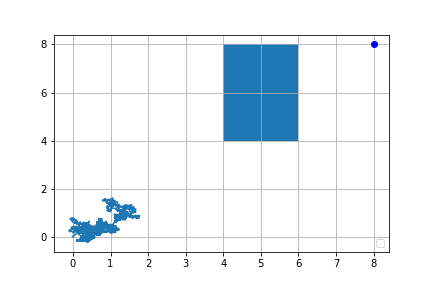

# Stochastic optimization for trajectory optimization.

Around 2016, Mark visited visited our lab when I was looking for research problems to graduate. He presented his works. And the work [1] took our attention. However, the method for the trajectory generation depends on a large number of sample trajectories. So most of us including myself thought that the method is mere heuristic.

1. Mueller, Mark W., Markus Hehn, and Raffaello D'Andrea. "A computationally efficient motion primitive for quadrocopter trajectory generation." IEEE transactions on robotics 31.6 (2015): 1294-1310.

Around 2019, Professor Theodorou visited our labe and presented his work on the model predictive path integral control [2]. His work has interesting paraphrasing of usaul optimal trajectory generation with using theories with the stochastic differential equation. However, when we actually implement the method, it becomes an optimization relying on random sampling. But, I was able to notice that I just did not realize the usefulness of the method [1] by Mark Mueller because his work is somewhat similar to the stochastic optimization in [2]. 

2. Williams G, Drews P, Goldfain B, Rehg JM, Theodorou EA. Aggressive driving with model predictive path integral control. In2016 IEEE International Conference on Robotics and Automation (ICRA) 2016 May 16 (pp. 1433-1440). IEEE.

The Pseudo code of an implementaion of the MPPI is as below

I implemented the algorithm above with the following simple linear and nonlinear dynamic model. I noted that the sample-based optimization works better with simple dynamics. Especially with the simple car model, the constraint seems to affect its performance. If you increase the time horizon, the performance will quickly degrade. Currently, I am doing some research on the sample complexity of the MPPI based on previous works on stochastic programming. 

## Sim 01: Double Integrator

The code is linked at [here](Example1.ipynb).

## Sim 02: Simple Car Model

The code is linked at [here](Example2.ipynb).
